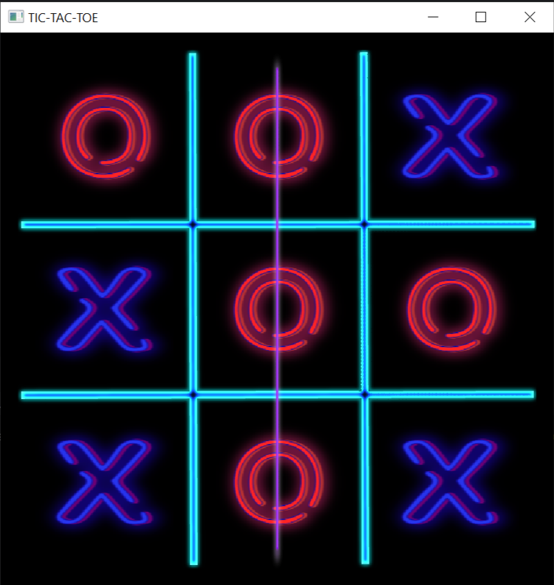

# Tic-tac-toe

This is my first game written in SFML.

## Launch application

1. Open `Makefile` and add to `SFML_INCLUDE` the path to **SFML include directories**;
2. Then add to `SFML_LIBRARY` the path to **SFML static libraries**;
3. Next enter `make` at the command line to generate file `main.exe`;
4. Run `./main` and enjoy this little game;